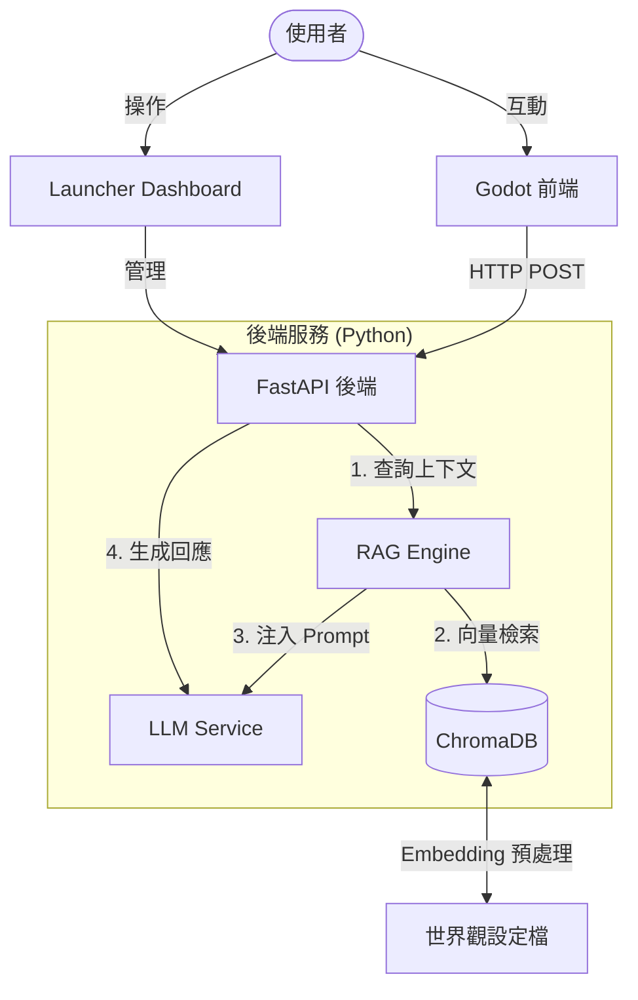
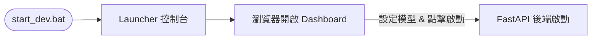

# AI Immersive RPG Agent (AIRPG)

一個以 **AI 驅動的沉浸式角色扮演對話系統**，透過 RAG 技術讓 AI 角色嚴格依照「世界觀設定集 (World Bible)」與玩家互動，並以 Godot Engine 提供豐富的前端體驗。

---

## 系統架構




### 技術堆疊


| 模組     | 技術                                        |
| ------ | ----------------------------------------- |
| 前端     | Godot Engine 4.4                          |
| 後端框架   | Python 3.10+ / FastAPI                    |
| LLM 編排 | LangChain (LCEL)                          |
| 向量資料庫  | ChromaDB                                  |
| 模型推論   | Ollama (本地) / OpenAI / Anthropic / Google |
| 嵌入模型   | `nomic-embed-text` (via Ollama)           |


---

## 快速啟動

### 前置需求

- **Python** 3.10+
- **Godot** 4.4+
- **Ollama** 已安裝並下載以下模型：
  - 對話模型：`llama3`（或自選）
  - 嵌入模型：`nomic-embed-text`（RAG 必要）
- **前端** 請用 Godot Engine 開啟 `client/` 資料夾，按 `F5` 執行，或匯出為 Web (HTML5) 格式。

### 使用 Launcher 啟動（推薦）




1. 開啟根目錄的 `start_dev.bat`
2. 瀏覽器自動開啟 `localhost:8080`（Launcher Dashboard）
3. 在 Dashboard 設定 AI 供應商與模型
4. 點擊「啟動伺服器」，待日誌顯示成功後點擊「進入遊戲」（會開啟 `http://localhost:8000/game/`；若已將 Godot 匯出到 `dist/` 則為瀏覽器版遊戲，否則可改點說明中的 API 文件連結）

若要停止所有服務，開啟 `stop_dev.bat`。

### 手動啟動（開發者）

```bash
# 1. 複製環境變數範本並填入 API Key
cp server/.env.example server/.env

# 2. 啟動後端
cd server
.\venv\Scripts\activate
pip install -r requirements.txt
uvicorn main:app --reload
```

若要連到不同後端位址（例如 Docker 或遠端主機），可在 Godot 的 **Project → Project Settings → Application → Config** 中設定 `server_url`，或直接編輯 `client/project.godot` 的 `config/server_url`。

### Docker 部署

1. 複製環境變數並依需編輯：`cp server/.env.example server/.env`
2. 在專案根目錄執行：`docker compose up -d`
3. 後端 API：`http://localhost:8000`；Launcher Dashboard：`http://localhost:8080`
4. 世界觀檔案放在 `server/data/`（會掛載進容器）；向量庫存於 Docker volume `airpg_chroma`。
5. 使用本機 Ollama 時，需在 host 先啟動 Ollama，並在 `.env` 使用 `LLM_MODE=ollama`。若後端在容器內要連 host 的 Ollama，可在 `.env` 加上 `OLLAMA_HOST=http://host.docker.internal:11434`（Windows/Mac Docker Desktop；Linux 可用 host 實際 IP）。

**說明**：Docker 模式下後端以獨立容器常駐，Dashboard 的「啟動伺服器」按鈕不適用；請用 Dashboard 做設定與「更新知識庫 (Ingest)」，遊戲客戶端連線至 `http://localhost:8000`（或 host 對外 IP）。

**Godot Web 遊戲**：將 Godot 專案匯出為 HTML5，輸出目錄設為專案根目錄下的 `dist/`（與 `server/`、`client/` 同層）。啟動 Docker 後，開啟 **http://localhost:8000/game/** 即可在瀏覽器玩。遊戲與 API 同源時，建議在 Godot 匯出前將 `config/server_url` 改為 **`/api/v1/chat/`**（相對路徑），這樣不需額外設定 CORS、且部署到不同網域時可再改回完整網址。

---

## API 規格

後端預設運行於 `http://localhost:8000`。

### `POST /api/v1/chat`

**請求：**

```json
{
  "user_id": "player_001",
  "message": "這座森林的歷史是什麼？",
  "character_id": "elf_ranger"
}
```

**成功回應 (200)：**

```json
{
  "response": "這座森林名為『蒼翠之森』，在三百年前的大戰中...",
  "emotion": "calm",
  "rag_context": ["蒼翠之森歷史片段...", "精靈族起源..."]
}
```

**錯誤回應 (500)：**

```json
{
  "error": "LLM Service Unavailable"
}
```

---

## 開發進度

### 第一階段：後端核心

- Python 環境配置 (venv)
- FastAPI 核心（`main.py`、`/health`、`POST /api/v1/chat`）
- RAG 引擎整合（LangChain + ChromaDB + `nomic-embed-text`）
- 知識庫處理（`ingest.py` 支援 `.md` 文件）

### 第二階段：開發工具管理

- 一鍵啟動 / 停止腳本（`start_dev.bat` / `stop_dev.bat`）
- Ollama 自動診斷、啟動與模型下載
- Launcher Dashboard（進程管理、模型切換、日誌檢視）
- 環境變數安全管理（`.env`）
- 增強系統除錯與型別處理 (IDE Warnings Fix)

### 第三階段：前端整合與容器化 (第一版目標)

- Godot 基礎通訊建置 (HTTPRequest)
- 基本 UI 介面實作 (對話框、角色狀態)
- **Docker 容器化部署** (Dockerfile & docker-compose)
- 全系統整合測試

### 第四階段：進階功能開發

- **長期記憶支援** (SQLite 儲存歷史上下文)
- 對話檢索優化 (調優 RAG 精度)
- 知識庫上傳管理介面

### 第五階段：體驗展演優化

- Godot UI/UX 與動效精雕
- 串流回傳 (Streaming SSE)
- 指令解析 (AI 控制遊戲狀態 JSON)

---

## 文件


| 文件                                                | 說明         |
| ------------------------------------------------- | ---------- |
| [backend_dev_guide.md](docs/backend_dev_guide.md) | 後端開發與架構說明  |
| [information_flow.md](docs/information_flow.md)   | 端到端資訊流與資料路徑 |
| [design_rationale.md](docs/design_rationale.md)   | 技術選型與設計決策  |
| [error_codes.md](docs/error_codes.md)             | 錯誤碼與訊息說明   |
| [todo.md](docs/todo.md)                           | 詳細任務清單     |


