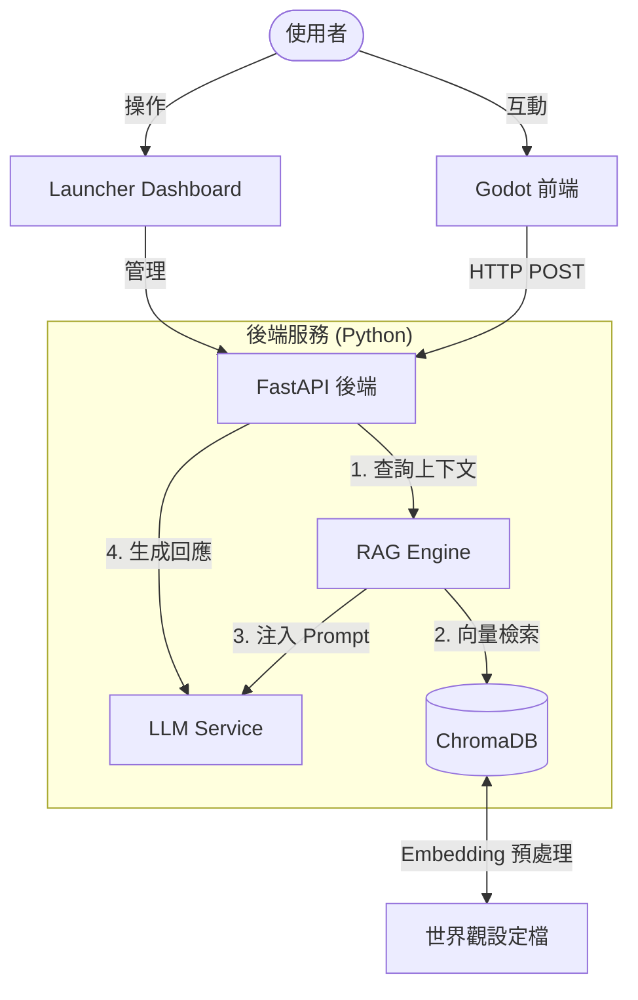
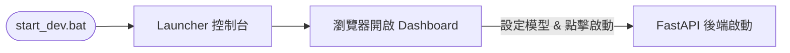

# AI Immersive RPG Agent · AIRPG

以 AI 驅動的沉浸式角色扮演對話系統。透過 RAG 讓角色依世界觀設定集回應，後端 FastAPI，前端 Godot 4.4。

## 現況


| 項目   | 狀態                                          |
| ---- | ------------------------------------------- |
| 狀態   | **可 Demo**：第一～三階段已完成，第四～五階段未做               |
| 後端   | FastAPI 對話 API、RAG、多供應商 LLM、Launcher、Docker |
| 前端   | Godot 對話 UI、角色表情、HTTP 串接；可匯出 Web 至 `dist/`  |
| 本機推論 | Ollama；亦可切雲端                                |
| 測試   | `server/tests` 單元與 API 層 E2E                |
| 未做   | 長期記憶 SQLite、RAG 重排調優、SSE 串流、知識庫上傳 UI        |


對齊細節見 `[docs/todo.md](docs/todo.md)`。

---

## 系統架構


```mermaid
graph TD
    User([使用者]) -->|操作| Dashboard[Launcher Dashboard]
    Dashboard -->|管理| API[FastAPI 後端]
    User -->|互動| Client[Godot 前端]
    Client -->|HTTP POST| API

    subgraph "後端服務 (Python)"
        API -->|1. 查詢上下文| RAG[RAG Engine]
        API -->|4. 生成回應| LLM[LLM Service]
        RAG -->|2. 向量檢索| VectorDB[(ChromaDB)]
        RAG -->|3. 注入 Prompt| LLM
    end

    VectorDB <-->|Embedding 預處理| WorldData[世界觀設定檔]
```


### 技術堆疊


| 模組     | 技術                                        |
| ------ | ----------------------------------------- |
| 前端     | Godot Engine 4.4                          |
| 後端框架   | Python 3.10+ / FastAPI                    |
| LLM 編排 | LangChain (LCEL)                          |
| 向量資料庫  | ChromaDB                                  |
| 模型推論   | Ollama (本地) / OpenAI / Anthropic / Google |
| 嵌入模型   | `nomic-embed-text` (via Ollama)           |


---


## 快速啟動


### 前置需求

- **Python** 3.10+
- **Godot** 4.4+
- **Ollama** 已安裝並下載以下模型：
  - 對話模型：`llama3`（或自選）
  - 嵌入模型：`nomic-embed-text`（RAG 必要）
- **前端** 請用 Godot Engine 開啟 `client/` 資料夾，按 `F5` 執行，或匯出為 Web (HTML5) 格式。


### 使用 Launcher 啟動（推薦）


```mermaid
graph LR
    A([start_dev.bat]) --> B[Launcher 控制台]
    B --> C[瀏覽器開啟 Dashboard]
    C -->|設定模型 & 點擊啟動| D[FastAPI 後端啟動]
```


1. 開啟根目錄的 `start_dev.bat`
2. 瀏覽器自動開啟 `localhost:8080`（Launcher Dashboard）
3. 在 Dashboard 設定 AI 供應商與模型
4. 點擊「啟動伺服器」，待日誌顯示成功後點擊「進入遊戲」（會開啟 `http://localhost:8000/game/`；若已將 Godot 匯出到 `dist/` 則為瀏覽器版遊戲，否則可改點說明中的 API 文件連結）

若要停止所有服務，開啟 `stop_dev.bat`。

### 手動啟動（開發者）

```bash
# 1. 複製環境變數範本並填入 API Key
cp server/.env.example server/.env

# 2. 啟動後端
cd server
.\venv\Scripts\activate
pip install -r requirements.txt
uvicorn main:app --reload
```

若要連到不同後端位址（例如 Docker 或遠端主機），可在 Godot 的 **Project → Project Settings → Application → Config** 中設定 `server_url`，或直接編輯 `client/project.godot` 的 `config/server_url`。

### 執行測試

於 `server` 目錄下執行單元與 API 層 E2E 測試（無需啟動 Chroma/Ollama）：

```bash
cd server
.\venv\Scripts\activate
python -m unittest discover -s tests -v
```

涵蓋 RAG 服務單元測試（`test_rag_service.py`）與全 API 路徑 E2E 測試（`test_e2e_api.py`）。

### Docker 部署

1. 複製環境變數並依需編輯：`cp server/.env.example server/.env`
2. 在專案根目錄執行：`docker compose up -d`
3. 後端 API：`http://localhost:8000`；Launcher Dashboard：`http://localhost:8080`
4. 世界觀檔案放在 `server/data/`（會掛載進容器）；向量庫存於 Docker volume `airpg_chroma`。
5. 使用本機 Ollama 時，需在 host 先啟動 Ollama，並在 `.env` 使用 `LLM_MODE=ollama`。若後端在容器內要連 host 的 Ollama，可在 `.env` 加上 `OLLAMA_HOST=http://host.docker.internal:11434`（Windows/Mac Docker Desktop；Linux 可用 host 實際 IP）。

**說明**：Docker 模式下後端以獨立容器常駐，Dashboard 的「啟動伺服器」按鈕不適用；請用 Dashboard 做設定與「更新知識庫 (Ingest)」，遊戲客戶端連線至 `http://localhost:8000`（或 host 對外 IP）。

**Godot Web 遊戲**：將 Godot 專案匯出為 HTML5，輸出目錄設為專案根目錄下的 `dist/`（與 `server/`、`client/` 同層）。啟動 Docker 後，開啟 **[http://localhost:8000/game/](http://localhost:8000/game/)** 即可在瀏覽器玩。遊戲與 API 同源時，建議在 Godot 匯出前將 `config/server_url` 改為 `**/api/v1/chat/`**（相對路徑），這樣不需額外設定 CORS、且部署到不同網域時可再改回完整網址。

---


## API 規格

後端預設運行於 `http://localhost:8000`。

### `POST /api/v1/chat`

**請求：**

```json
{
  "user_id": "player_001",
  "message": "這座森林的歷史是什麼？",
  "character_id": "elf_ranger"
}
```

**成功回應 (200)：**

```json
{
  "response": "這座森林名為『蒼翠之森』，在三百年前的大戰中...",
  "emotion": "calm",
  "rag_context": ["蒼翠之森歷史片段...", "精靈族起源..."]
}
```

**錯誤回應 (500)：**

```json
{
  "error": "LLM Service Unavailable"
}
```

---


## 開發進度

與 `[docs/todo.md](docs/todo.md)` 同步。`[x]` 已完成，`[ ]` 未做。

### 第一階段：後端核心 · 已完成

- [x] Python 環境、FastAPI 核心、`/health`、`POST /api/v1/chat`
- [x] RAG：LangChain + ChromaDB + `nomic-embed-text`
- [x] 知識庫 ingest，支援 `.md`


### 第二階段：開發工具與管理 · 已完成

- [x] `start_dev.bat`／`stop_dev.bat`、Ollama 診斷與模型拉取
- [x] Launcher Dashboard：進程、模型切換、日誌、進入遊戲
- [x] `.env` 設定、Godot `server_url` 可設定、`/game` Web 匯出掛載


### 第三階段：前端整合與容器化 · 已完成

- [x] Godot HTTP 通訊、對話框、角色表情
- [x] Docker／docker-compose
- [x] API 層 E2E 測試


### 第四階段：進階功能 · 未做

- [ ] 長期記憶：SQLite 與歷史檢索
- [ ] RAG 精度調優：chunking、rerank
- [ ] Launcher 知識庫上傳／刪除 UI


### 第五階段：體驗展演 · 未做

- [ ] Godot UI／動效精修
- [ ] SSE 串流回傳
- [ ] AI JSON 指令驅動遊戲狀態

---


## 文件


| 文件                                                | 說明          |
| ------------------------------------------------- | ----------- |
| [backend_dev_guide.md](docs/backend_dev_guide.md) | 後端開發與架構說明   |
| [information_flow.md](docs/information_flow.md)   | 端到端資訊流與資料路徑 |
| [design_rationale.md](docs/design_rationale.md)   | 技術選型與設計決策   |
| [error_codes.md](docs/error_codes.md)             | 錯誤碼與訊息說明    |
| [todo.md](docs/todo.md)                           | 詳細任務清單      |


