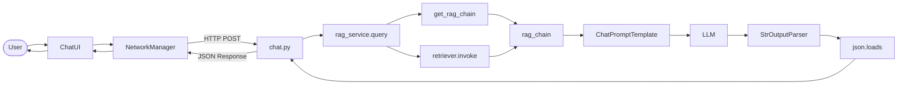

# AIRPG 端到端資訊流

本文件描述「從使用者輸入到畫面更新」的完整資料路徑，適合理解系統架構與除錯時追蹤請求流向。

---

## 流程圖

---

## 1. 從使用者到後端

- **Godot 畫面**：使用者在輸入框輸入文字並送出。
- **ChatUI.gd**：`_send_message()` 取得輸入、清空輸入框、將使用者訊息 append 到對話區，並呼叫 `NetworkManager.send_message(text)`。
- **NetworkManager.gd**：組裝 JSON body（`message`、`user_id`、`character_id`），以 HTTP POST 送往 `server_url`（預設 `http://127.0.0.1:8000/api/v1/chat/`）。
- 請求送達 **FastAPI**，路由對應到 `POST /api/v1/chat/`。

---

## 2. 後端 API 層

- **chat.py** 的 `chat(request)` 收到 `ChatRequest`（Pydantic 驗證通過）。
- 目前僅使用 **request.message**；`user_id`、`character_id` 保留供日後多角色／多使用者使用。
- 呼叫 **rag_service.query(message=request.message)**，取得包含 `response`、`emotion`、`animation_trigger`、`rag_context` 的字典。
- 將結果包成 **ChatResponse**，以 JSON 回傳給客戶端；若發生例外則回傳 500。

---

## 3. RAG 服務內部（rag_service.query）

### 3.1 取得 chain 與檢索

- **get_rag_chain()** 的呼叫者只有 **query()**；chat 端點透過呼叫 `query()` 間接觸發，不會直接呼叫 `get_rag_chain()`。
- `get_rag_chain()` 若尚未初始化，會依 config 建立 Chroma retriever、ChatPromptTemplate、LLM、StrOutputParser，組成一條 LCEL chain 並以 singleton 形式快取，回傳 `(rag_chain, retriever)`。
- **retriever.invoke(message)**：以使用者的 `message` 做向量檢索，從 Chroma 取出相關文件，經 `_format_docs` 合併成一大段「世界觀背景」文字作為 **context**；同一批檢索結果的純文字會存成 **rag_context**，最後一併放在 API 回應中。

### 3.2 輸出給 LLM 與接收回傳

- **輸出給 LLM**：**ChatPromptTemplate（prompt）** 負責把 `context` 與 `question`（即使用者的 message）組合成要送給模型的 messages（system + human），這份輸入就是送進 LLM 的內容。
- **接收 LLM 回傳**：**StrOutputParser()** 接收 LLM 的 AIMessage，轉成一個字串（預期為 JSON 字串），即 `raw_output`。
- **query()** 再對 `raw_output` 做清理（例如去掉 markdown 程式碼區塊標記）後 **json.loads**，取得 `response`、`emotion`、`animation_trigger`；若解析失敗則以原始文字當 `response`，`emotion` 預設為 `"neutral"`。
- **emotion** 由 **LLM** 在產出的 JSON 中決定，RAG 只提供世界觀 context，不計算或指定 emotion。

---

## 4. 從後端回到 Godot

- FastAPI 回傳 **ChatResponse** 的 JSON（含 `response`、`emotion`、`animation_trigger`、`rag_context`）。
- **NetworkManager.gd** 的 `_on_request_completed` 收到 response body，解析 JSON：若有 `response` 則 emit **response_received(text, emotion, animation_trigger)**；若有 `error` 則 emit **request_failed(error_msg)**。
- **ChatUI.gd** 訂閱上述信號：收到 `response_received` 時將 AI 文字 append 到對話區，並依 `emotion` 更換頭像；收到 `request_failed` 時顯示錯誤訊息。

---

## 與程式對照

| 步驟 | 檔案／位置 |
|------|------------|
| 前端發送 | `client/scripts/ChatUI.gd`（_send_message）、`client/scripts/NetworkManager.gd`（send_message） |
| API 端點 | `server/app/api/v1/endpoints/chat.py`（chat） |
| 呼叫 get_rag_chain | `server/app/services/rag_service.py` 的 **query()**（約第 121 行） |
| 輸出給 LLM | `rag_service.py` 的 **ChatPromptTemplate**（約第 88–91 行） |
| 接收 LLM 回傳 | `rag_service.py` 的 **StrOutputParser()**（chain 最後一節，約第 105 行） |
| 解析 JSON、組回傳 | `rag_service.py` 的 **query()**（約第 130–147 行） |
| 前端接收與更新 | `NetworkManager.gd`（_on_request_completed）、`ChatUI.gd`（_on_ai_response_received） |
